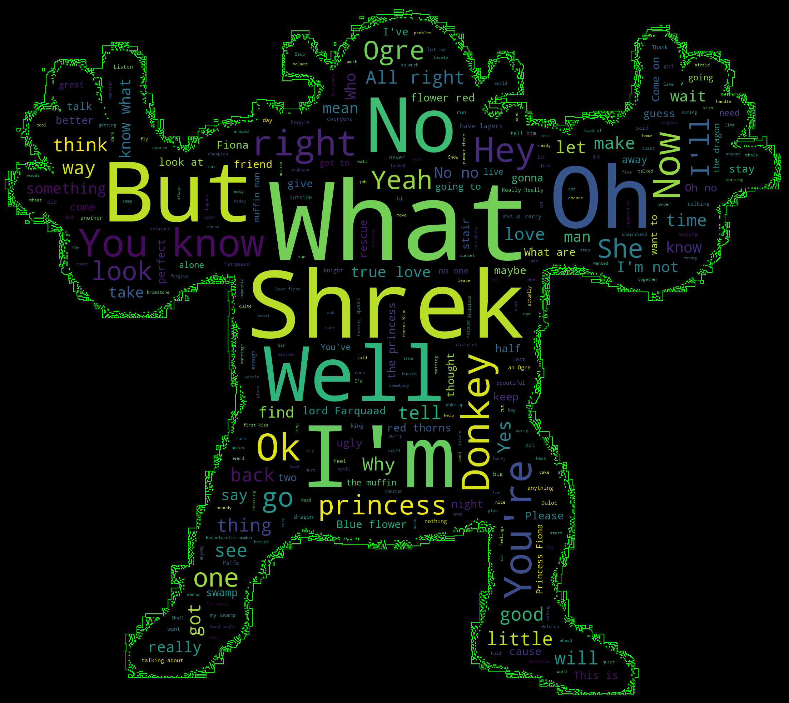

# Wordcloud Test

Super easy example of wordcloud module.

## Result
---


## Code
---
```python
import numpy as np

from os import path, getcwd
from PIL import Image
from wordcloud import WordCloud, STOPWORDS

curr_dir = getcwd()


mask = np.array((Image.open(curr_dir + "/data/shrek_mask.jpg")))

with open(path.join(curr_dir + "/data/shrek.txt"), "r") as f:
    text = f.read()

wc = WordCloud(max_words=2000, stopwords=STOPWORDS, scale=3, contour_color="lime",contour_width=0.1,
               mask=mask, random_state=1, margin=10, background_color="black").generate(text)

wc.to_file("shrek.png")
```